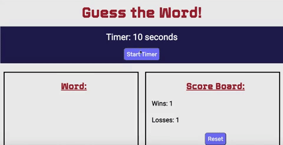

# Guess-the-Word

<a href="https://tbetti.github.io/Guess-the-Word/">Link to Application</a>
<h3>Description</h3>

This application is a game where users have 10 seconds to guess a computer-related word one letter at a time.  It is comprised of HTML, CSS, and JavaScript files.  Google Fonts is also utilized for styling purposes.
 

<h3>How to Play</h3>

When the user presses the "Start Timer" button, the timer begins at 10 seconds. Users are then presented with a series of blank spaces to correspond with each letter of a mystery word.  As they press the correct letter keys, the blank spaces are replaced by the correct letters.  If the user correctly guesses the word, the timer resets and the winning score increases by 1 point.  If the timer reaches 0 and the user has not correctly guessed the word, a "Game Over" message displays and the losing score increases by 1 point.  Scores are saved in local storage, and may be reset by clicking the "Reset" button. 

<h3>Licencse</h3>